Step 1: SSH Exchange between local computer and Github account

cd to home dir and create .ssh/ folder if it doesn't exist

cd ~/.ssh
ssh-keygen

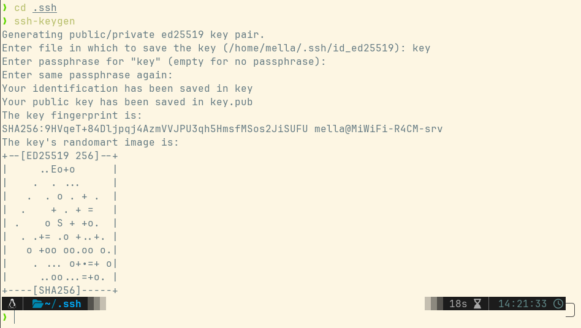

Give the key a name key. Then list ls the content of .ssh/ folder.

Copy the content of the public key

cat key.pub

Go to the Settings of your Github account from profile section. Go to Access Section on the left SSH and GPG Keys and New SSH key. Give a title and paste the content of key.pub

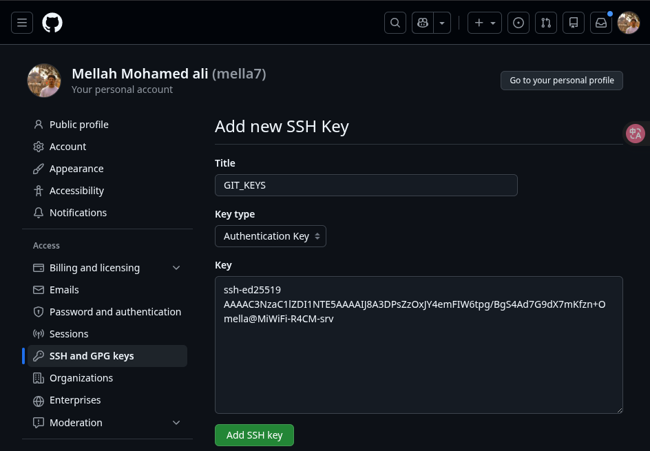

Back to the computer terminal and run the command

export GIT_SSH_COMMAND="ssh -i ~/.ssh/key"

Create a project folder in your Desktop or anywhere you'd prefer

mkdir ~/Projects/K8s-Devsecops-Portfolio-CI-CD-Project && cd ~/Projects/K8s-Devsecops-Portfolio-CI-CD-Project


Git Clone the application code and IaC repositories
git clone https://github.com/mella7/Portfolio.git
git clone https://github.com/mella7/iac_code.git
cd iac_code
git config core.sshCommand "ssh -i ~/.ssh/key -F /dev/null"
cd ..
cd reactjs-quiz-app
git config core.sshCommand "ssh -i ~/.ssh/key -F /dev/null"

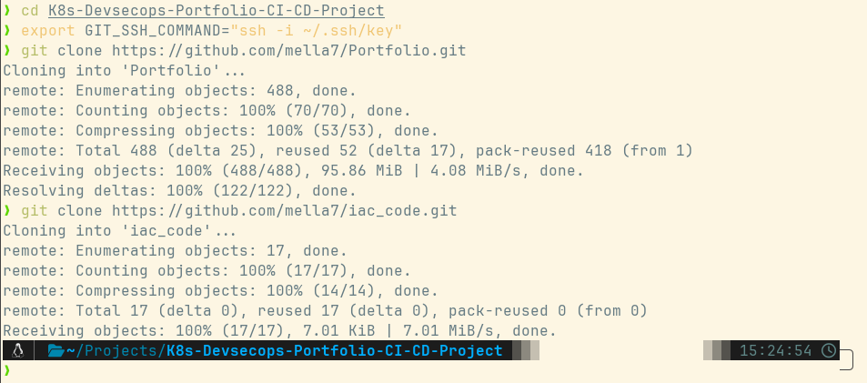#### Connect the repository to your Github

[](https://github.com/cloudcore-hub/Kubernetes-DevSecOps-CI-CD-Project/tree/master?tab=readme-ov-file#connect-the-repository-to-your-github)

1. **Create a New Repository on GitHub:**
    - Go to GitHub and sign in.
    - Go to your profile and open Your repositories
    - Click the `New` icon in the top-right corner to create new repository.
    - Name your repository `iac`, set it to public or private, and click "Create repository."

2. **Change the Remote URL of Your Local Repository:**
    - Open your terminal and navigate to the root directory of your local repository.
    - Check the current remote URL with:
        
        ```
        cd iac_code
        git remote -v
        ```
        
    - Change the remote URL to your newly created repository with:
        
        ```
        git remote set-url origin <YOUR_NEW_REPOSITORY_URL>
        ```
        
        Replace `YOUR_NEW_REPOSITORY_URL` with the URL of your new GitHub repository, like `https://github.com/yourusername/yourrepositoryname.git`.


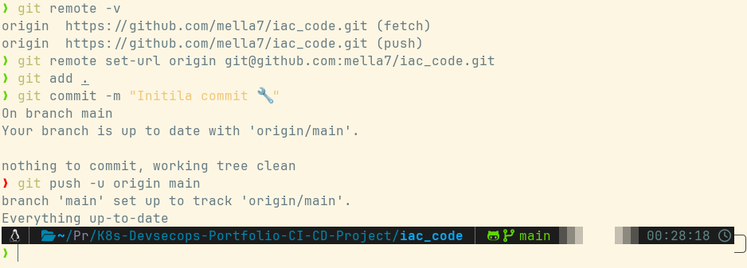

3. **Push Your Code to the New Repository:**
    
    - Ensure all your changes are committed. If you have uncommitted changes, add them using:
        
        ```
        git add .
        ```
        
    - Commit the changes with:
        
        ```
        git commit -m "Initial commit"
        ```
        
    - Push the code to your new repository with:
        
        ```
        git push -u origin master
        ```
        
        If your main branch is named differently (e.g., `main`), replace `master` with the correct branch name.
4. **Verify the Push:**
    
    - Refresh the GitHub page of your repository to see if the code has been pushed successfully.
5. **Repeat for the second repo:**  
    You can name the second repo `reactjs` for simplicity When done, run the following command in your terminal
    

```
git config --global user.name <your github user name>
git config --global user.email <your github email>
```


### Step 2: CREATE AWS Resources


#### Create an IAM user and generate the AWS Access key


Create a new IAM User on AWS and give it the AdministratorAccess for testing purposes (not recommended for your Organization's Projects) Go to the AWS IAM Service and click on Users.

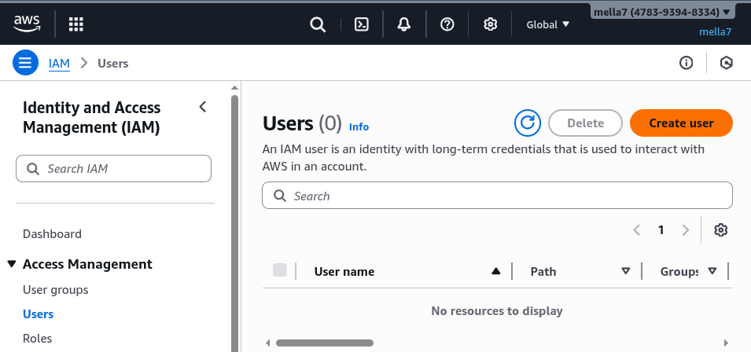

Click on Create user

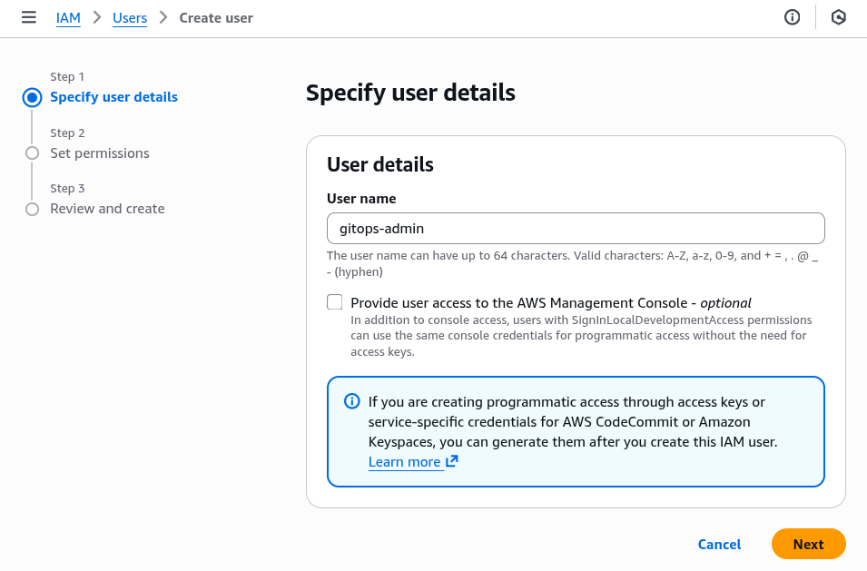

Provide the name to your user and click on Next.

Select the Attach policies directly option and search for AdministratorAccess then select it.


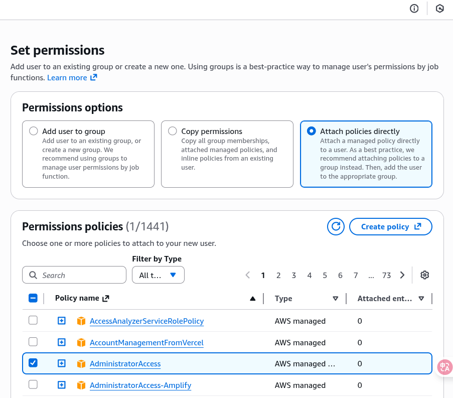

Click on Next.


Click on Create user

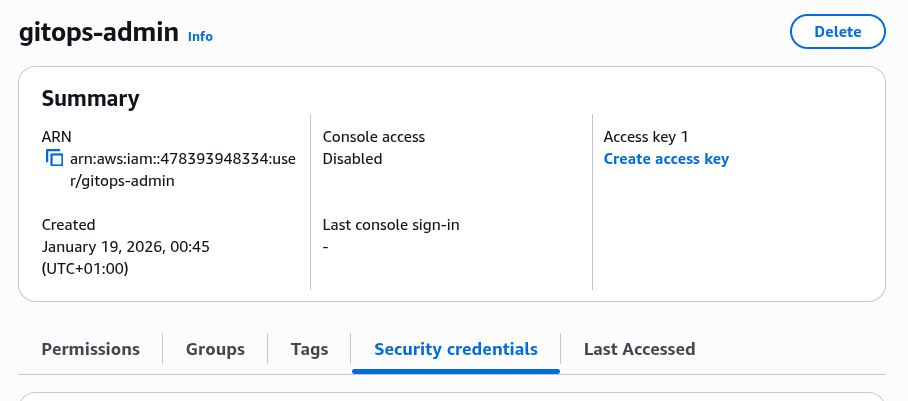

Now, Select your created user then click on `Security credentials` and generate access key by clicking on Create access key.


Select the `Command Line Interface (CLI)` then select the checkmark for the confirmation and click on Next.

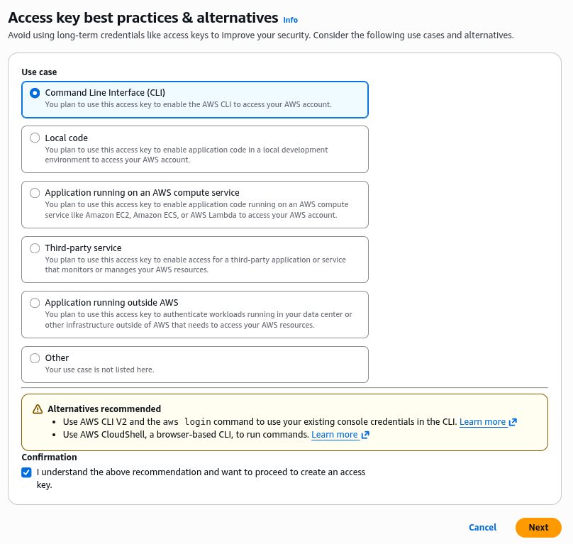

Provide the Description and click on the Create access key.

Here, you will see that you got the credentials and also you can download the CSV file for the future. Copy the Access Key ID and the Access Secret Key

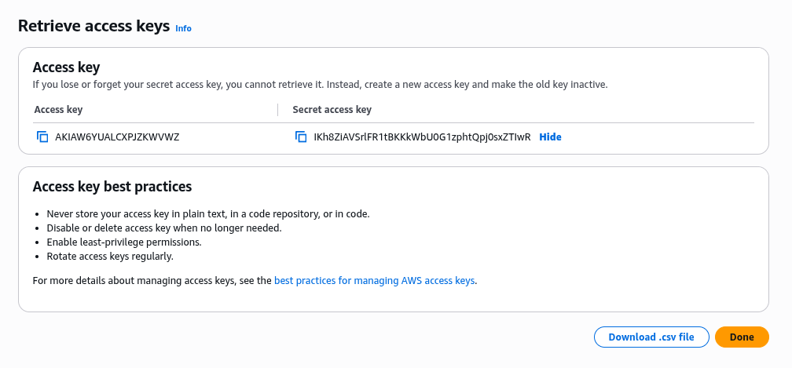
#### Create Github Repo Secret for iac

[](https://github.com/cloudcore-hub/Kubernetes-DevSecOps-CI-CD-Project/tree/master?tab=readme-ov-file#create-github-repo-secret-for-iac)

1. **Navigate to Your GitHub Repository created in step 1:**
    
    - Find and click on the iac repository where you want to add a secret.
2. **Access the Repository Settings:**
    
    - Click on the "Settings" tab near the top of the repository page.


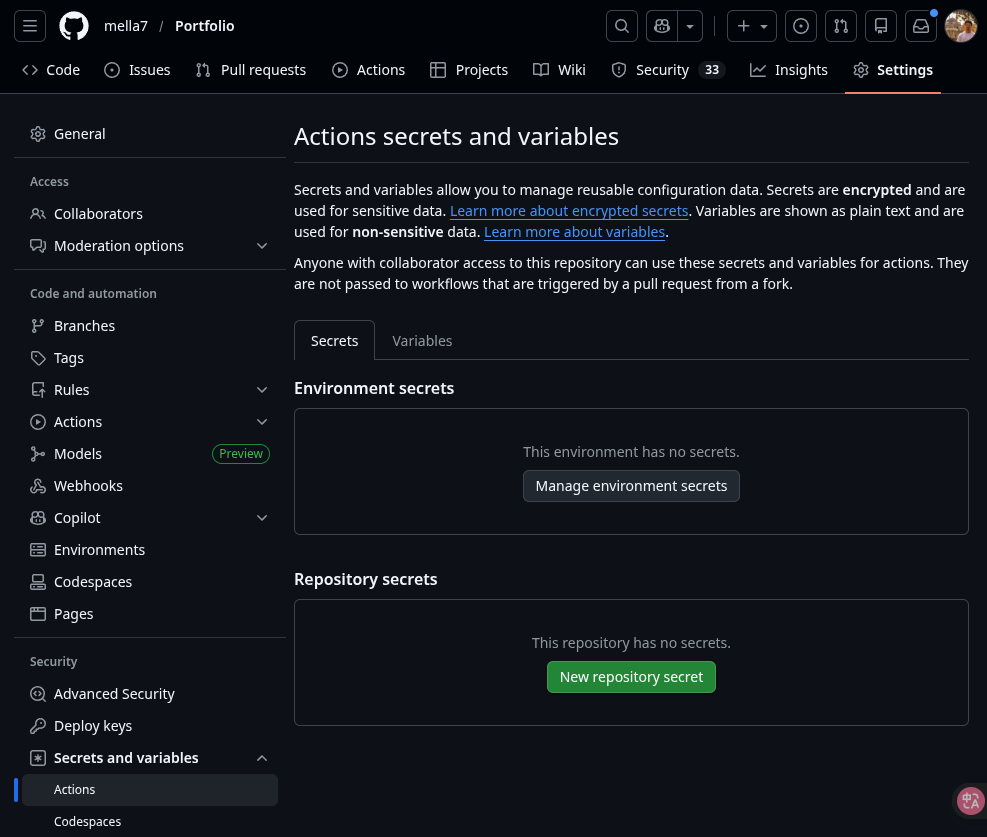

3. **Open the Secrets Section:**
    
    - On the left sidebar, click on "Secrets and variables."
    - Then select "Actions" to add a secret available to GitHub Actions.
4. **Add a New Secret:**
    
    - Click on the "New repository secret" button.
    - Enter the name of your secret in the "Name" field. Use `AWS_ACCESS_KEY_ID`.
    - Enter the value of your secret in the "Value" field.
5. **Save the Secret:**
    
    - Click the "Add secret" button to save your new secret.
    - The secret is now stored securely and can be accessed in GitHub Actions workflows using the `${{ secrets.AWS_ACCESS_KEY_ID }}` syntax, where `AWS_ACCESS_KEY_ID` is the name you gave your secret. Do same for the `AWS_SECRET_ACCESS_KEY`, add the Secret and save


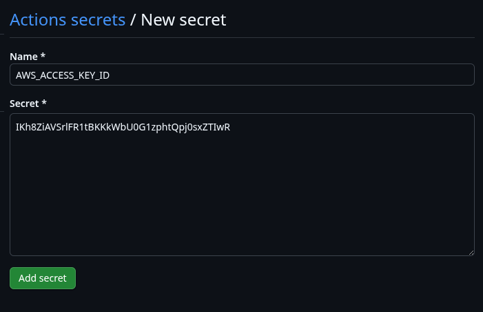


6. **Repeat 1-5 for app code repository:**

#### Create S3 Bucket for Terraform State files

[](https://github.com/cloudcore-hub/Kubernetes-DevSecOps-CI-CD-Project/tree/master?tab=readme-ov-file#create-s3-bucket-for-terraform-state-files)

Create S3 bucket for the terraform state file. Add the bucket name in the iac_code repo secret. Name: `BUCKET_TF`, Value: `<your-bucket-name>`


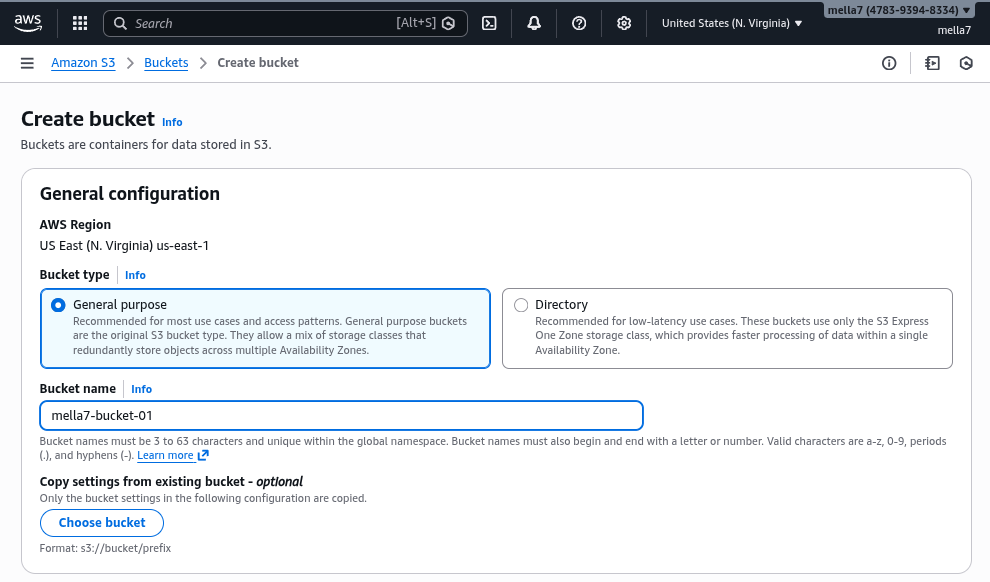

#### Create key pair

[](https://github.com/cloudcore-hub/Kubernetes-DevSecOps-CI-CD-Project/tree/master?tab=readme-ov-file#create-key-pair)

Create key pair for SSHing into the jumphost in .pem format and download it in your local machine

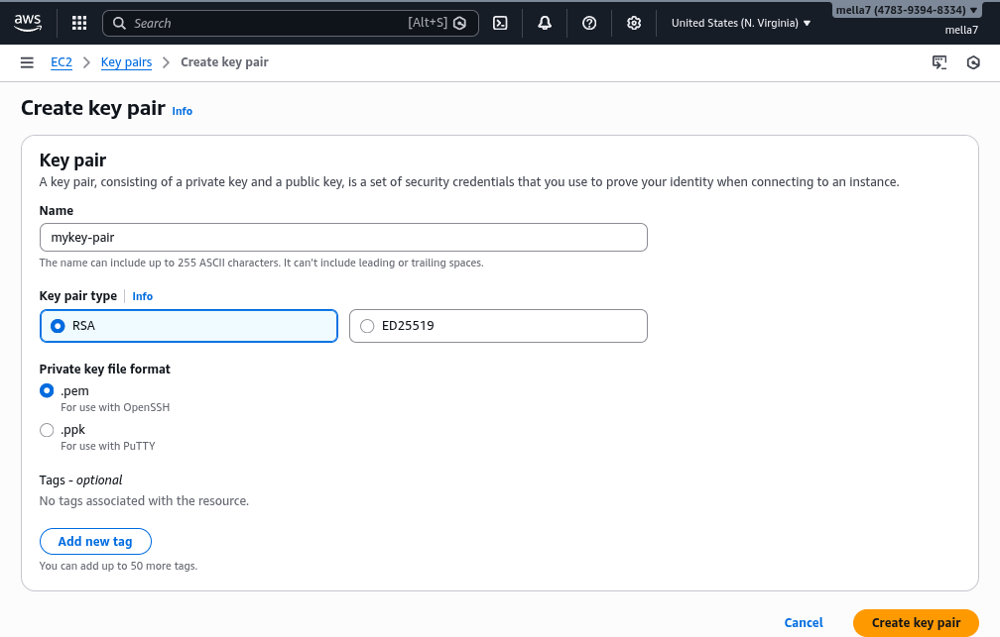

test
## Verify the EC2 instance is running

AWS Console → **EC2 → Instances** (region **us-east-1**)  
Find your jumphost instance (id starts with `i-0655231b...`) → state must be **Running**.

Public IP from Terraform output:

ssh -i mykey-pair.pem ec2-user@3.226.253.59

### Step 3: Install Terraform & AWS CLI .

[](https://github.com/cloudcore-hub/Kubernetes-DevSecOps-CI-CD-Project/tree/master?tab=readme-ov-file#step-3-install-terraform--aws-cli-)

Install & Configure Terraform and AWS CLI on your local machine

#### Terraform Installation Script for WSL

[](https://github.com/cloudcore-hub/Kubernetes-DevSecOps-CI-CD-Project/tree/master?tab=readme-ov-file#terraform-installation-script-for-wsl)

```
wget -O- https://apt.releases.hashicorp.com/gpg | sudo gpg - dearmor -o /usr/share/keyrings/hashicorp-archive-keyring.gpg
echo "deb [signed-by=/usr/share/keyrings/hashicorp-archive-keyring.gpg] https://apt.releases.hashicorp.com $(lsb_release -cs) main" | sudo tee /etc/apt/sources.list.d/hashicorp.list
sudo apt update
sudo apt install terraform -y
```

#### AWSCLI Installation Script

[](https://github.com/cloudcore-hub/Kubernetes-DevSecOps-CI-CD-Project/tree/master?tab=readme-ov-file#awscli-installation-script)

```
curl "https://awscli.amazonaws.com/awscli-exe-linux-x86_64.zip" -o "awscliv2.zip"
sudo apt install unzip -y
unzip awscliv2.zip
sudo ./aws/install
```

Now, Configure both the tools

#### Terraform and AWSCLI Installation on MacOS

[](https://github.com/cloudcore-hub/Kubernetes-DevSecOps-CI-CD-Project/tree/master?tab=readme-ov-file#terraform-and-awscli-installation-on-macos)

```
brew install terraform
brew install awscli
```

#### Configure AWS CLI

[](https://github.com/cloudcore-hub/Kubernetes-DevSecOps-CI-CD-Project/tree/master?tab=readme-ov-file#configure-aws-cli)

Run the below command, and add your keys from Step 2

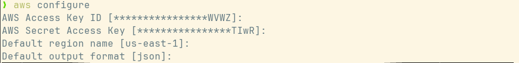
### Step 4: Deploy the Jumphost Server(EC2) using Terraform on Github Actions

[](https://github.com/cloudcore-hub/Kubernetes-DevSecOps-CI-CD-Project/tree/master?tab=readme-ov-file#step-4-deploy-the-jumphost-serverec2-using-terraform-on-github-actions)

```
cd ~/Desktop/project/iac_code
```

Open the folder in Visual Studio Code or any Text Editor Navigate to the terraform folder

Do some modifications to the `terraform.tf` file such as changing the bucket name (make sure you have created the bucket manually on AWS console).


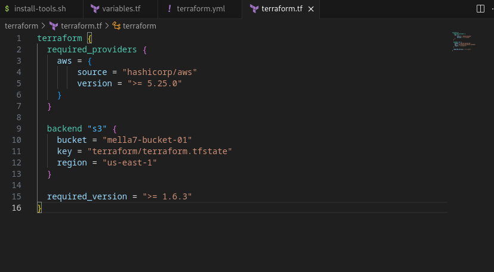

Now, in the `variables.tf` you can change some of the variable `region`, `vpc-name`, `ami_id`, `instance_type`, but you must replace the `instance_keypair` with the Pem File name as you have for your Pem file. Provide the Pem file name that is already created on AWS.

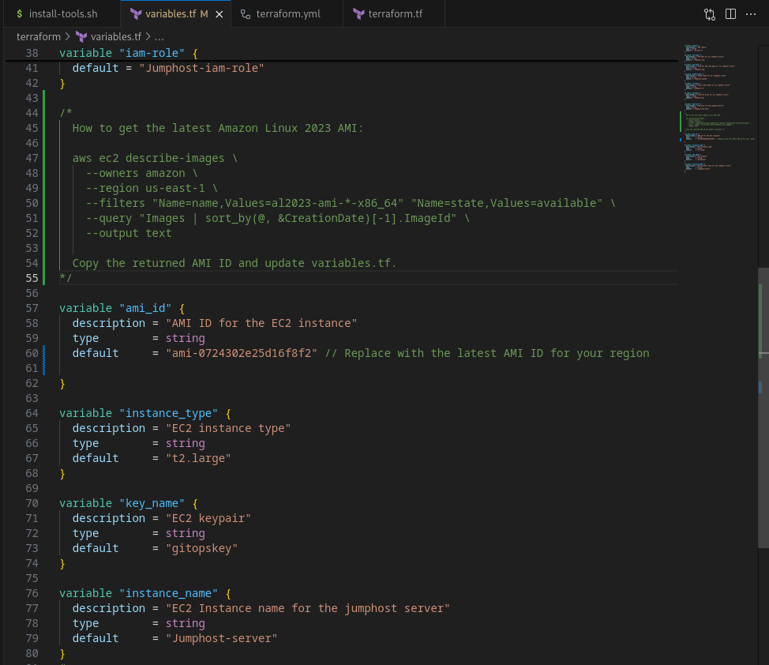

Review `.github/workflows/terraform.yml`

```
git commit -am "updated terraform files"
git push
```

With the couple of changed made in the terraform/ folder. Github Actions workflow will be trigger. Go to the repo on Github abd click on the Actions button to the see the Github Action workflow running.

Go to the EC2 on AWS Console Now, connect to your Jumphost-Server by clicking on Connect.

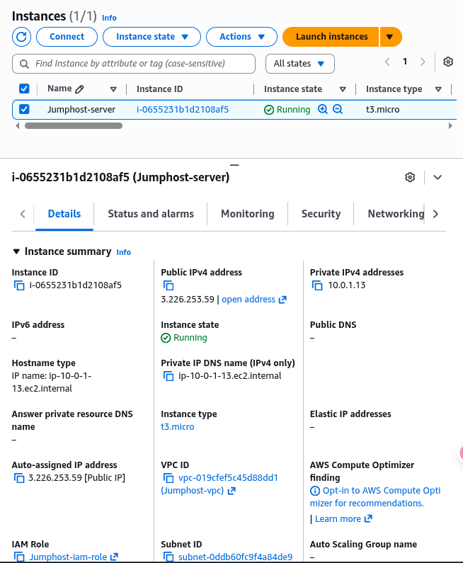

Copy the ssh command and paste it on your local machine. Be sure you are in the same folder where your key pair is saved or provide the path to the key. For first time use incase of file permission error, run

Chmod 400 key.pem

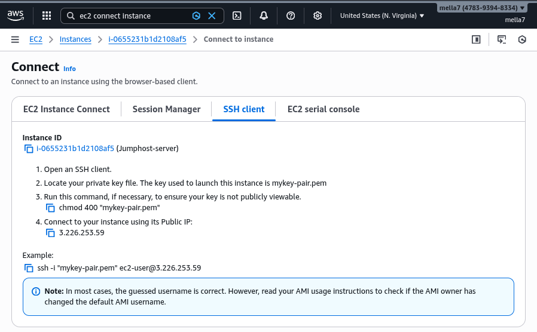

and try SSHing again


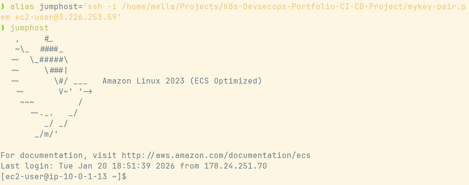

### Step 5: Configure the Jumphost

[](https://github.com/cloudcore-hub/Kubernetes-DevSecOps-CI-CD-Project/tree/master?tab=readme-ov-file#step-5-configure-the-jumphost)

We have installed some services such as Docker, Terraform, Kubectl, eksctl, AWSCLI, Trivy

Validate whether all our tools are installed or not.

```
docker --version
docker ps
terraform --version
kubectl version
aws --version
trivy --version
eksctl version
```


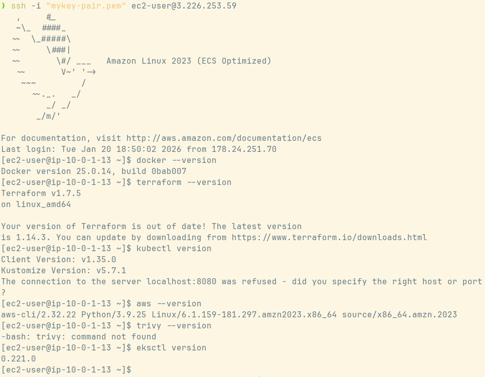


---
in case you used a minimalist image like me because of the the current free tier limitations
set it up first

## Jumphost setup (Amazon Linux 2023)

### 1. Connect to the instance

`ssh -i mykey-pair.pem ec2-user@<PUBLIC_IP>`

---

### 2. Update the system

`sudo dnf update -y`

---

### 3. Install Docker

`sudo dnf install -y docker sudo systemctl enable --now docker sudo usermod -aG docker ec2-user newgrp docker docker --version`

---

### 4. Install AWS CLI (already present on AL2023, verify)

`aws --version`

---

### 5. Install Terraform

`cd /tmp curl -LO https://releases.hashicorp.com/terraform/1.7.5/terraform_1.7.5_linux_amd64.zip unzip terraform_1.7.5_linux_amd64.zip sudo mv terraform /usr/local/bin/ terraform --version`

---

### 6. Install kubectl

`cd /tmp curl -LO https://dl.k8s.io/release/$(curl -L -s https://dl.k8s.io/release/stable.txt)/bin/linux/amd64/kubectl chmod +x kubectl sudo mv kubectl /usr/local/bin/ kubectl version --client`

---

### 7. Install eksctl

`cd /tmp curl -LO https://github.com/eksctl-io/eksctl/releases/latest/download/eksctl_Linux_amd64.tar.gz tar -xzf eksctl_Linux_amd64.tar.gz sudo mv eksctl /usr/local/bin/ eksctl version`

---

### 8. Install Helm

`curl https://raw.githubusercontent.com/helm/helm/main/scripts/get-helm-3 | bash helm version`

---

### 9. Verify IAM role access (no AWS keys needed)

`aws sts get-caller-identity`

---

### 10. Optional: convenience SSH alias (local machine)

`alias jumphost='ssh -i /full/path/to/mykey-pair.pem ec2-user@<PUBLIC_IP>'`


---


#### Create an eks cluster using the below commands.

[](https://github.com/cloudcore-hub/Kubernetes-DevSecOps-CI-CD-Project/tree/master?tab=readme-ov-file#create-an-eks-cluster-using-the-below-commands)

This might take 15-20 minutes. Also adjust the node count

```
eksctl create cluster --name quizapp-eks-cluster --region us-east-1 --node-type t2.large --nodes-min 2 --nodes-max 4
```

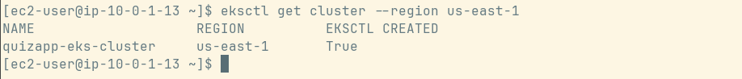

Run the command below to connect to the EKS cluster created allowing Kubernetes operations on that cluster.

aws eks update-kubeconfig --region us-east-1 --name quizapp-eks-cluster
Once the cluster is created, you can validate whether your nodes are ready or not by the below command

kubectl get nodes
Configure Load Balancer on the EKS
Configure the Load Balancer on our EKS because our application will have an ingress controller. Download the policy for the LoadBalancer prerequisite.

curl -O https://raw.githubusercontent.com/kubernetes-sigs/aws-load-balancer-controller/v2.5.4/docs/install/iam_policy.json
Create IAM policy
Create the IAM policy using the below command

aws iam create-policy --policy-name AWSLoadBalancerControllerIAMPolicy --policy-document file://iam_policy.json
Create OIDC Provider
To allows the cluster to integrate with AWS IAM for assigning IAM roles to Kubernetes service accounts, enhancing security and management.

eksctl utils associate-iam-oidc-provider --region=us-east-1 --cluster=quizapp-eks-cluster --approve
Create Service Account
Add your aws 12-digit account ID

eksctl create iamserviceaccount --cluster=quizapp-eks-cluster --namespace=kube-system --name=aws-load-balancer-controller --role-name AmazonEKSLoadBalancerControllerRole --attach-policy-arn=arn:aws:iam::<ACCOUNT-ID>:policy/AWSLoadBalancerControllerIAMPolicy --approve --region=us-east-1


Run the below command to deploy the AWS Load Balancer Controller using Helm

```
sudo snap install helm --classic
helm repo add eks https://aws.github.io/eks-charts
helm repo update eks
helm install aws-load-balancer-controller eks/aws-load-balancer-controller -n kube-system --set clusterName=quizapp-eks-cluster --set serviceAccount.create=false --set serviceAccount.name=aws-load-balancer-controller
```

Wait for 2 minutes and run the following command below to check whether aws-load-balancer-controller pods are running or not.

```
kubectl get deployment -n kube-system aws-load-balancer-controller
```

### Step 6: Setup Docker Repositories to allow image push for Frontend & Backend images

[](https://github.com/cloudcore-hub/Kubernetes-DevSecOps-CI-CD-Project/tree/master?tab=readme-ov-file#step-6-setup-docker-repositories-to-allow-image-push-for--frontend--backend-images)

Sign in into your Dockerhub Account

#### Create Docker Secret

[](https://github.com/cloudcore-hub/Kubernetes-DevSecOps-CI-CD-Project/tree/master?tab=readme-ov-file#create-docker-secret)

Go to Dockerhub page, click on your profile and select My Account. Then go to Security and click on New Access Token. Give it a name in the Access Token Description and Generate. Copy the token and add to `app` repo secrets, name it `DOCKER_PASSWORD` and paste the docker generated token. Also add another secret name it `DOCKER_USERNAME` and paste your dockerhub account username


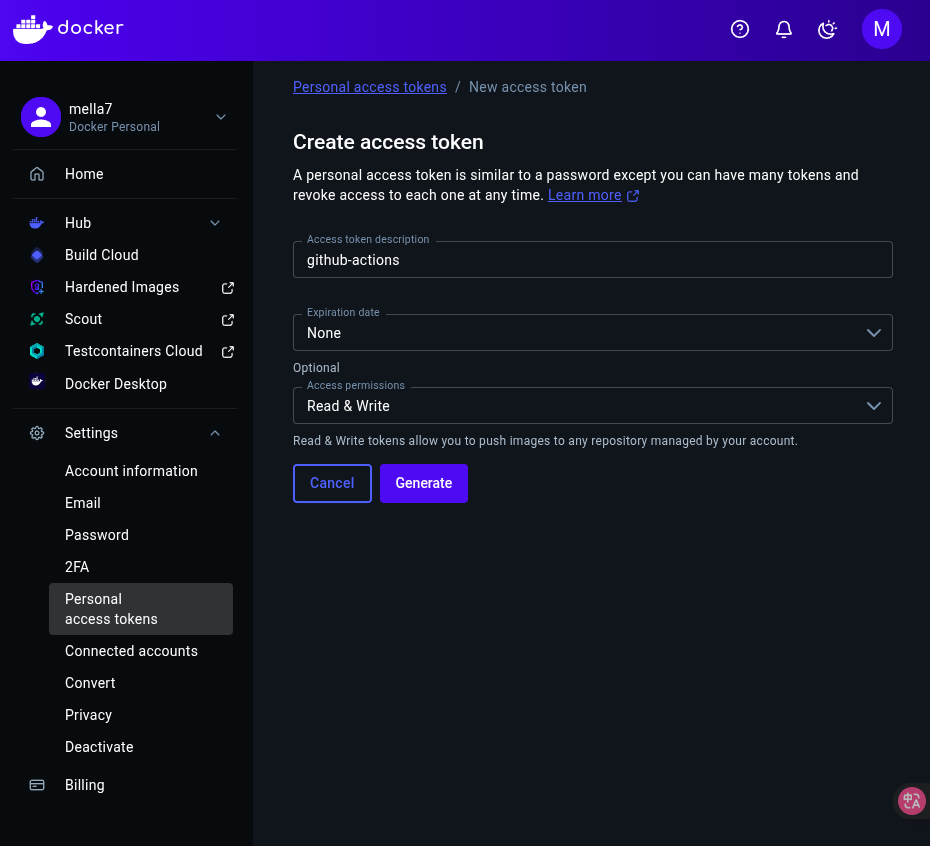


### Step 7: Configure Sonar Cloud for our app_code Pipeline

[](https://github.com/cloudcore-hub/Kubernetes-DevSecOps-CI-CD-Project/tree/master?tab=readme-ov-file#step-7-configure-sonar-cloud-for-our-app_code-pipeline)

Sonar cloud will be using for Code Quality Analysis of our application code.

#### 1. Create a SonarCloud Account

[](https://github.com/cloudcore-hub/Kubernetes-DevSecOps-CI-CD-Project/tree/master?tab=readme-ov-file#1-create-a-sonarcloud-account)

- Go to [SonarCloud](https://sonarcloud.io/) and click on **Sign up**.
- Choose the option to sign up using GitHub, Bitbucket, or GitLab.
- Follow the prompts to authorize SonarCloud to access your account.


2. Create a New Public Organization


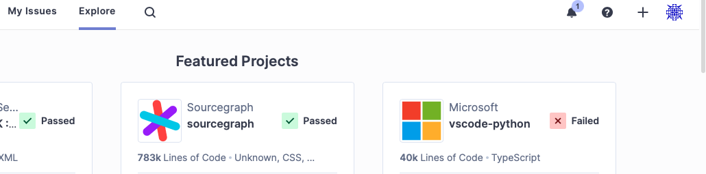


- Once logged in, go to **+** (top-right corner) and select **Create new organization**.
- Choose the service where your code is hosted (GitHub, Bitbucket, GitLab).
- Follow the on-screen instructions to select your account and set up a new organization.
- Choose **Public** for the organization’s visibility.


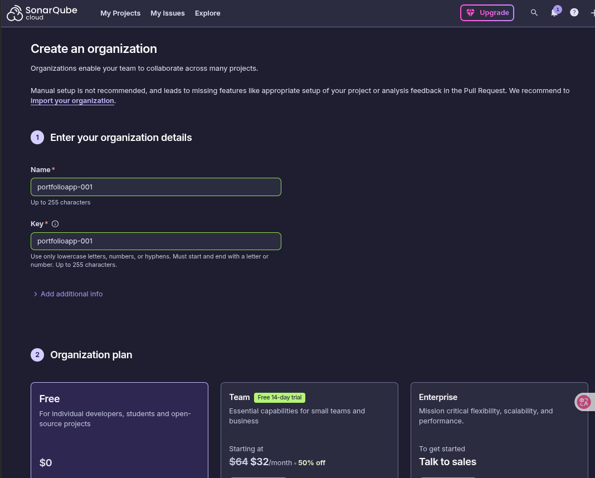


#### 3. Create a Project

[](https://github.com/cloudcore-hub/Kubernetes-DevSecOps-CI-CD-Project/tree/master?tab=readme-ov-file#3-create-a-project)

- In your new organization, click on **+** and select **Analyze new project**. Enter name and key. Then clikc on previous version and save


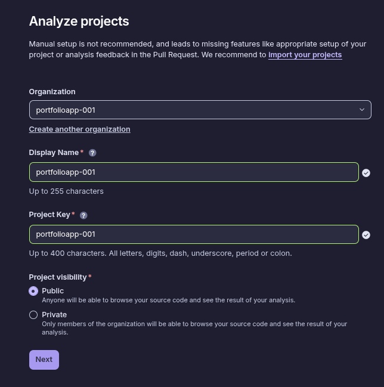


#### 4. Create a Token

[](https://github.com/cloudcore-hub/Kubernetes-DevSecOps-CI-CD-Project/tree/master?tab=readme-ov-file#4-create-a-token)

- Go to **My Account > Security**.
- Under **Tokens**, enter a name for your new token and click **Generate**.
- Save the generated token securely. You will use this token in your analysis commands or CI/CD configuration.


e70949332c423fd680c95132a50bc4f2fd1ff436


**Note**: Keep your token confidential and use it as per the instructions for analyzing your project, either locally using SonarScanner or through your CI/CD pipeline.

Copy this token to Github app code repository secret Name: SONAR_TOKEN secret: paste the sonarcloud token

Add another secret Name: SONAR_ORGANIZATION secret: enter your sonar cloud organization name created above

Add another secret Name: SONAR_PROJECT_KEY secret: enter your sonar cloud project key

Add another secret Name: SONAR_URL secret: [https://sonarcloud.io](https://sonarcloud.io/)

### Step 8: Setup Synk Token for the app code pipeline

[](https://github.com/cloudcore-hub/Kubernetes-DevSecOps-CI-CD-Project/tree/master?tab=readme-ov-file#step-8-setup-synk-token-for-the-app-code-pipeline)

#### 1. Sign Up for Snyk

[](https://github.com/cloudcore-hub/Kubernetes-DevSecOps-CI-CD-Project/tree/master?tab=readme-ov-file#1-sign-up-for-snyk)

- Visit the [Snyk website](https://snyk.io/) and click on the "Sign Up" button.
- You can sign up using your GitHub, GitLab, Bitbucket account, or an email address.

#### 2. Verify Your Email

[](https://github.com/cloudcore-hub/Kubernetes-DevSecOps-CI-CD-Project/tree/master?tab=readme-ov-file#2-verify-your-email)

- If you signed up with an email, verify your email address by clicking on the verification link sent to your email.

#### 3. Log in to Your Snyk Account

[](https://github.com/cloudcore-hub/Kubernetes-DevSecOps-CI-CD-Project/tree/master?tab=readme-ov-file#3-log-in-to-your-snyk-account)

- After verifying your email or signing up through a version control system, log in to your Snyk account.

#### 4. Generate a Snyk Token

[](https://github.com/cloudcore-hub/Kubernetes-DevSecOps-CI-CD-Project/tree/master?tab=readme-ov-file#4-generate-a-snyk-token)

- Navigate to the account settings or your profile settings.
- Look for the API tokens section.
- Click on "Generate Token" or "Create New Token."
- Name your token and, if given the option, set the scopes or permissions for the token.
- Click "Generate" or "Create."

#### 5. Secure Your Token

[](https://github.com/cloudcore-hub/Kubernetes-DevSecOps-CI-CD-Project/tree/master?tab=readme-ov-file#5-secure-your-token)

- Copy the generated token and keep it secure. Do not share your token in public places.


127c5df9-3c7c-476e-a334-8d98f09aab9f


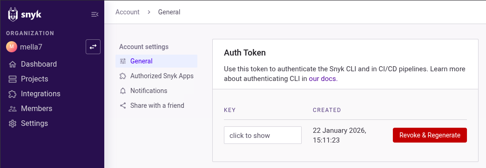


You can now use this token to authenticate and integrate Snyk with your projects or CI/CD pipelines.

Copy this token to Github app code repository secret Name: SNYK_TOKEN secret: paste the snyk token

### Step 9: Review and Deploy Application Code

[](https://github.com/cloudcore-hub/Kubernetes-DevSecOps-CI-CD-Project/tree/master?tab=readme-ov-file#step-9-review-and-deploy-application-code)

Review the app code repo. In your local terminal cd ~/Desktop/project/reactjs-quiz-app Open the folder in Visual Studio Code

Update the kubernetes-manifest/ingress.yaml file with your DNS Review .github/workflows/quizapp.yml file


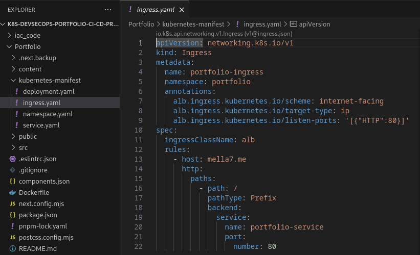


git commit -am "updated manifest files"
git push
Step 10: Configure ArgoCD
Create the namespace for the EKS Cluster. In your jumphost server terminal

kubectl create namespace portfolio
kubectl get namespaces
or

kubectl get ns
Now, we will install argoCD. To do that, create a separate namespace for it and apply the argocd configuration for installation.

kubectl create namespace argocd
kubectl apply -n argocd -f https://raw.githubusercontent.com/argoproj/argo-cd/v2.4.7/manifests/install.yaml


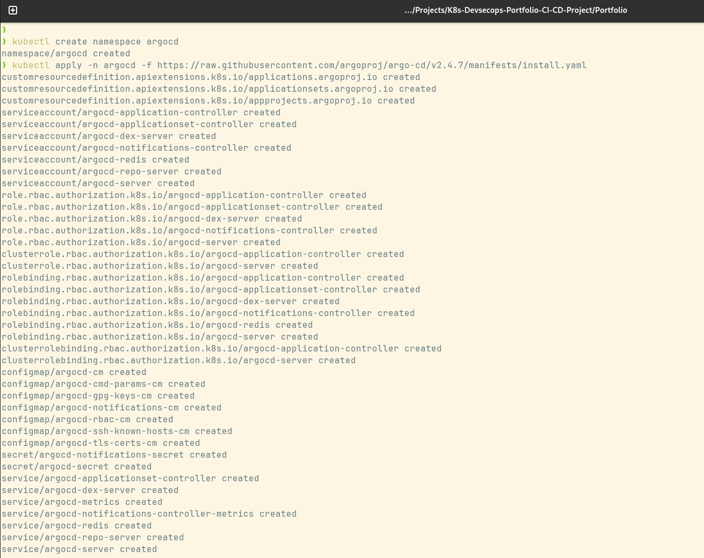


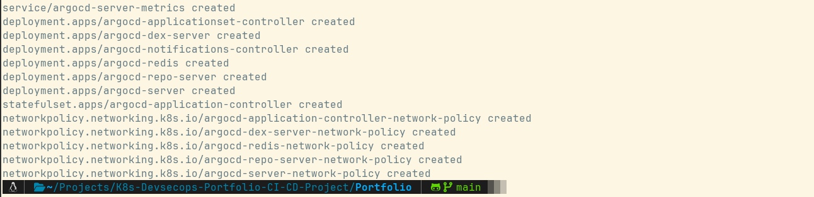


To confirm argoCD pods are running. All pods must be running, to validate run the below command

```
kubectl get pods -n argocd
```


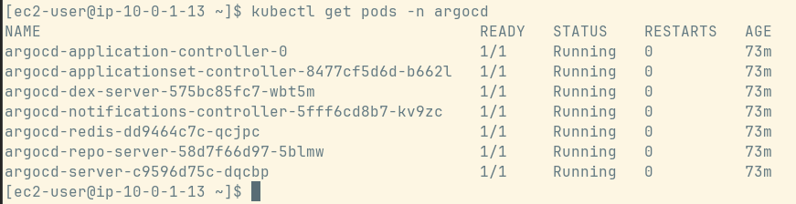


Now, expose the argoCD server as LoadBalancer using the below command

kubectl patch svc argocd-server -n argocd -p '{"spec": {"type": "LoadBalancer"}}'

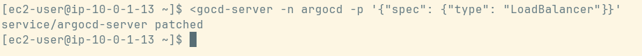


You can validate whether the Load Balancer is created or not by going to the AWS Console


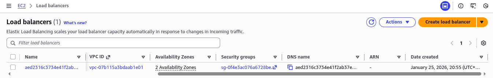

To access the argoCD, copy the LoadBalancer DNS and hit on your browser.

You will get a warning like the below snippet.

Click on Advanced.


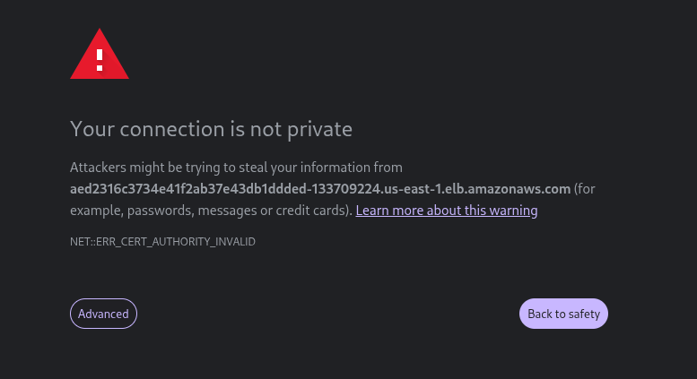

Click on the below link which is appearing under Hide advanced


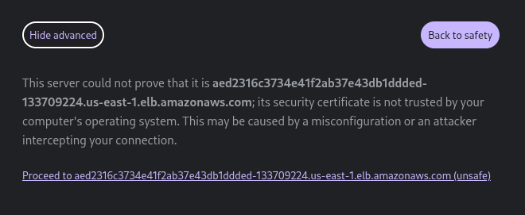


Now, we need to get the password for our argoCD server to perform the deployment.

To do that, we need a pre-requisite which is jq. This has already been Installed or you can install it using the command below.

```
sudo apt install jq -y
```

```
export ARGOCD_SERVER=`kubectl get svc argocd-server -n argocd -o json | jq --raw-output '.status.loadBalancer.ingress[0].hostname'`
export ARGO_PWD=`kubectl -n argocd get secret argocd-initial-admin-secret -o jsonpath="{.data.password}" | base64 -d`
```

---

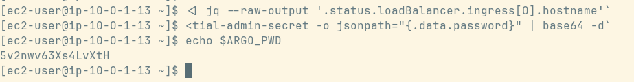

Enter the username `admin` and password in argoCD and click on SIGN IN.


Here is our ArgoCD Dashboard.

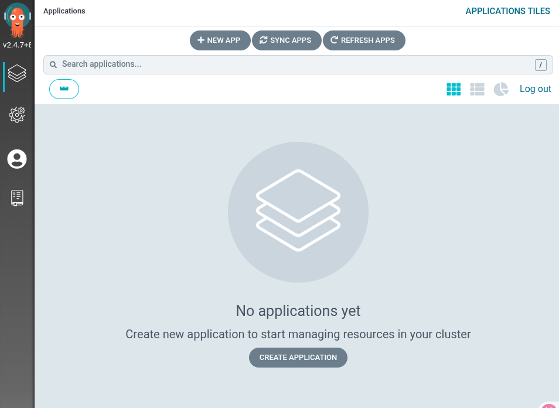

### Step 11: Set up the Monitoring for our EKS Cluster using Prometheus and Grafana.

[](https://github.com/cloudcore-hub/Kubernetes-DevSecOps-CI-CD-Project/tree/master?tab=readme-ov-file#step-11-set-up-the-monitoring-for-our-eks-cluster-using-prometheus-and-grafana)

We can monitor the Cluster Specifications and other necessary things.

We will achieve the monitoring using Helm Add all the helm repos, the prometheus, grafana repo by using the below command

```
helm repo add prometheus-community https://prometheus-community.github.io/helm-charts
helm repo add grafana https://grafana.github.io/helm-charts
helm repo add ingress-nginx https://kubernetes.github.io/ingress-nginx
helm repo update
```

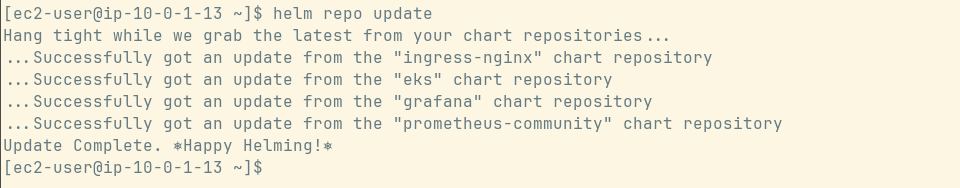


Install the prometheus

```
helm install prometheus prometheus-community/kube-prometheus-stack -n monitoring --create-namespace
```


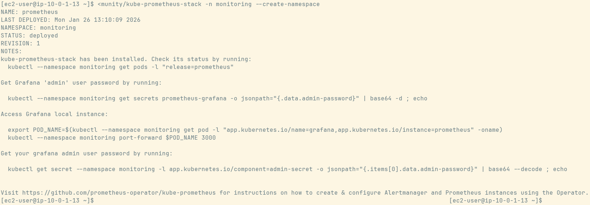

Install the Grafana

```
helm install grafana grafana/grafana -n monitoring --create-namespace
```


Get Grafana `admin` user password using:

```
kubectl get secret --namespace monitoring grafana -o jsonpath="{.data.admin-password}" | base64 --decode ; echo
```

Now, confirm the services using the below command

```
kubectl get svc -n monitoring
```


Now, we need to access our Prometheus and Grafana consoles from outside of the cluster.

For that, we need to change the Service type from ClusterIP to LoadBalancer

Edit the prometheus-server service

```
kubectl edit svc prometheus-kube-prometheus-prometheus -n monitoring
```

Modification in the 48th line from ClusterIP to LoadBalancer

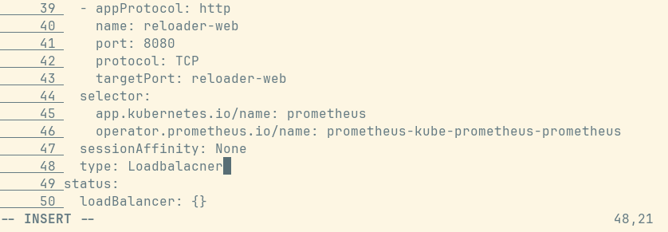


Edit the Grafana service

```
kubectl edit svc grafana -n monitoring
```

Modification in the 39th line from ClusterIP to LoadBalancer


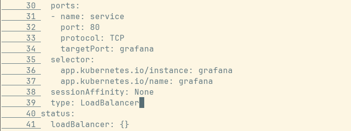


Now, if you list again the service then, you will see the LoadBalancers DNS names

```
kubectl get svc -n monitoring
```

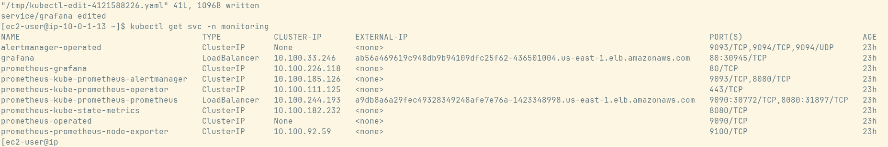

You can also validate from AWS LB console.

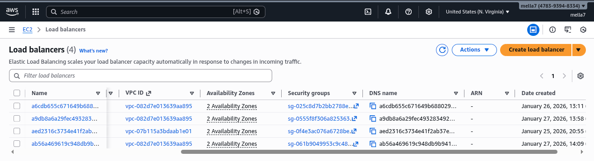


Now, access your Prometheus Dashboard Paste the :9090 in your browser and you will see something like this

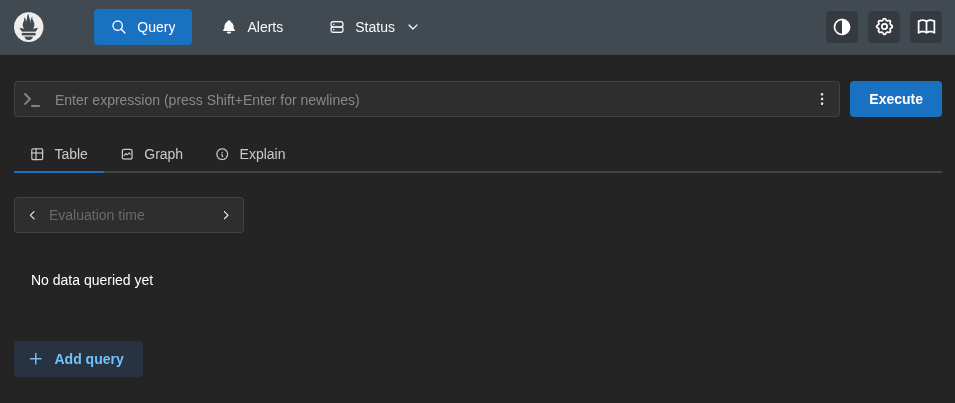

Click on Status and select Target. You will see a lot of Targets

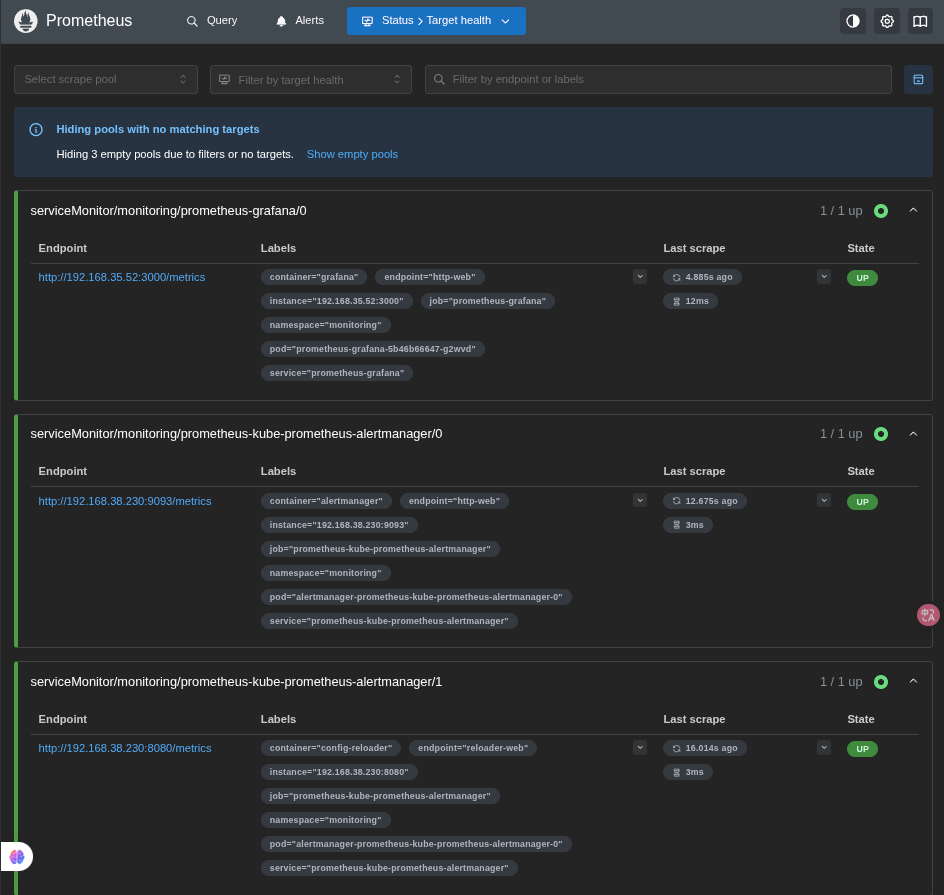

Now, access your Grafana Dashboard Copy the ALB DNS of Grafana and paste it into your browser.


Get your 'admin' user password by running:

```
kubectl get secret --namespace monitoring grafana -o jsonpath="{.data.admin-password}" | base64 --decode ; echo
```

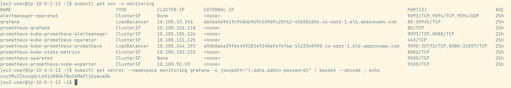


The username will be admin and the password will be from the command above for your Grafana LogIn.


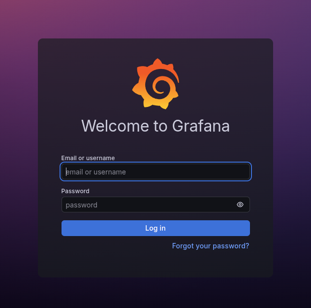
6xSOBjlRa5BvxW44Q5XCg0AhDZ31ra5YAYCTB80E

Now, click on Data Source

Select Prometheus

In the Connection, paste your :9090

If the URL is correct, then you will see a green notification/ Click on Save & test.

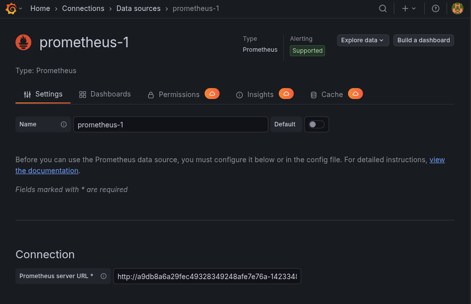

Now, we will create a dashboard to visualize our Kubernetes Cluster Logs. Click on Dashboard.


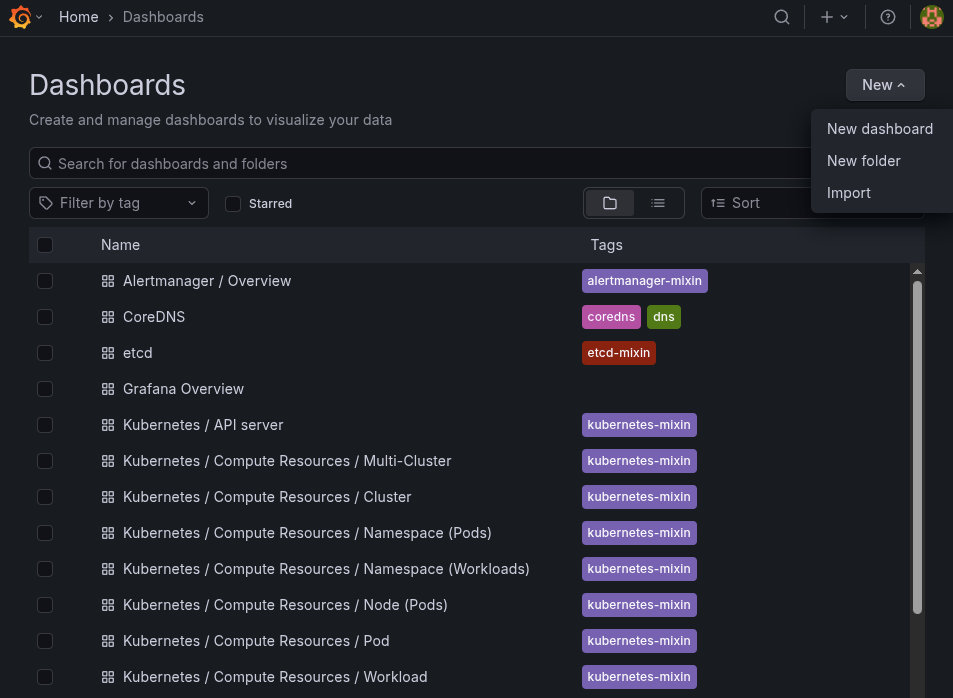


Once you click on Dashboard. You will see a lot of Kubernetes components monitoring.

Let’s try to import a type of Kubernetes Dashboard. Click on New and select Import

Provide 6417 ID and click on Load Note: 6417 is a unique ID from Grafana which is used to Monitor and visualize Kubernetes Data


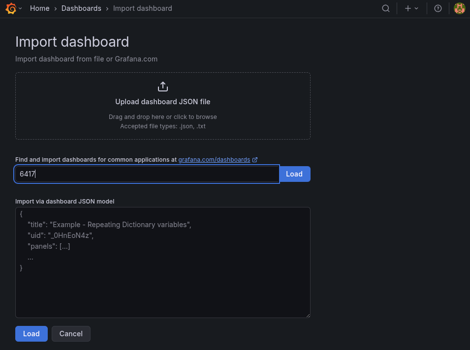

Select the data source that you have created earlier and click on Import.

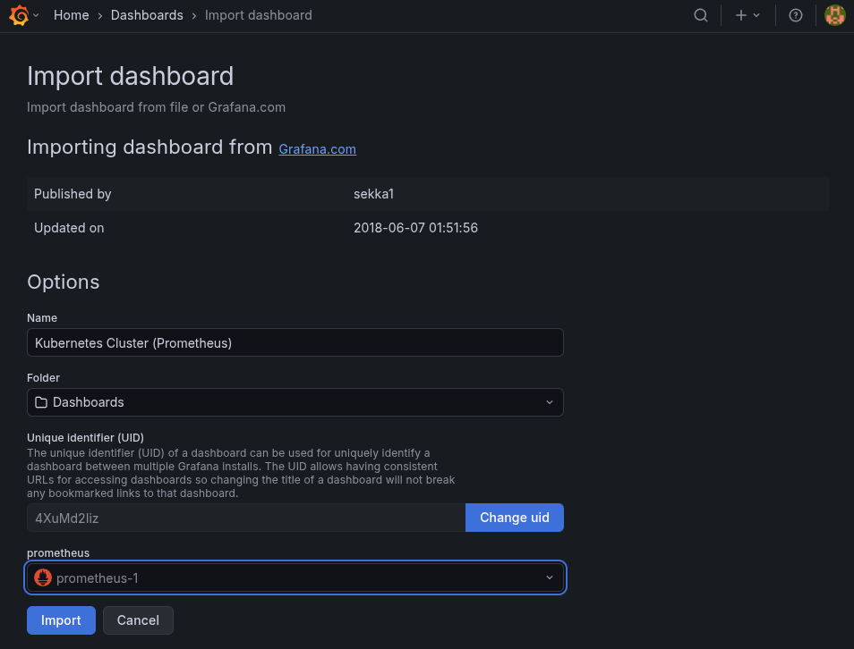

Here, you go. You can view your Kubernetes Cluster Data. Feel free to explore the other details of the Kubernetes Cluster.

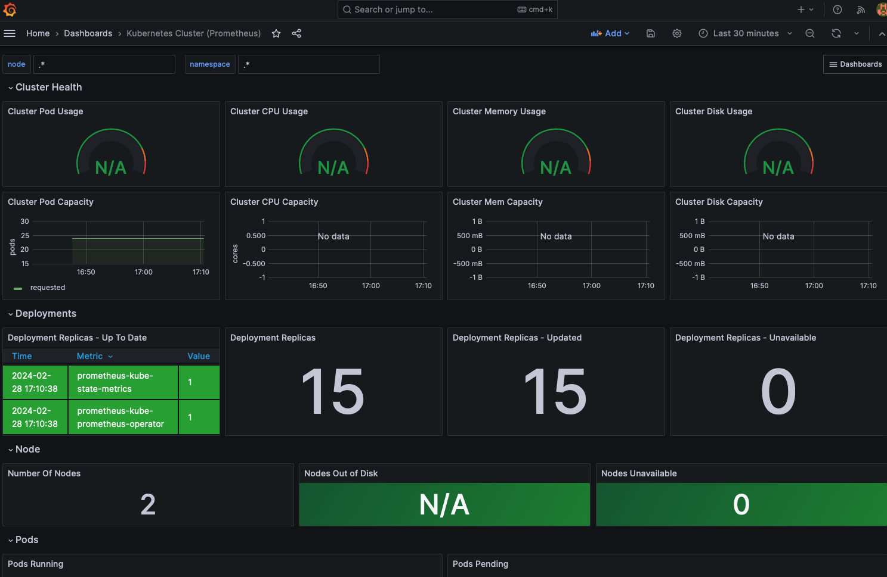


Step 12: Deploy Quiz Application using ArgoCD. Configure the app_code github repository in ArgoCD. Click on Settings and select Repositories


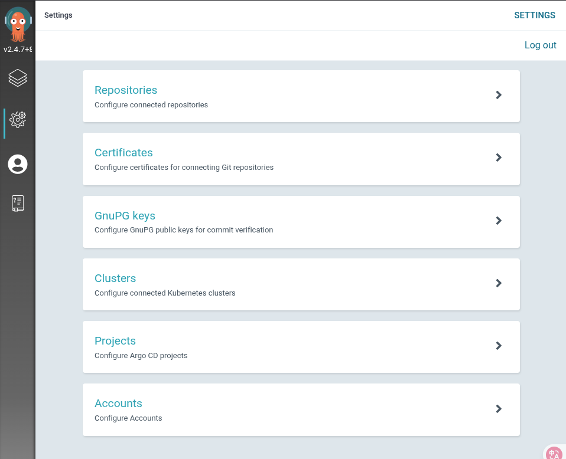

Click on CONNECT REPO USING HTTPS

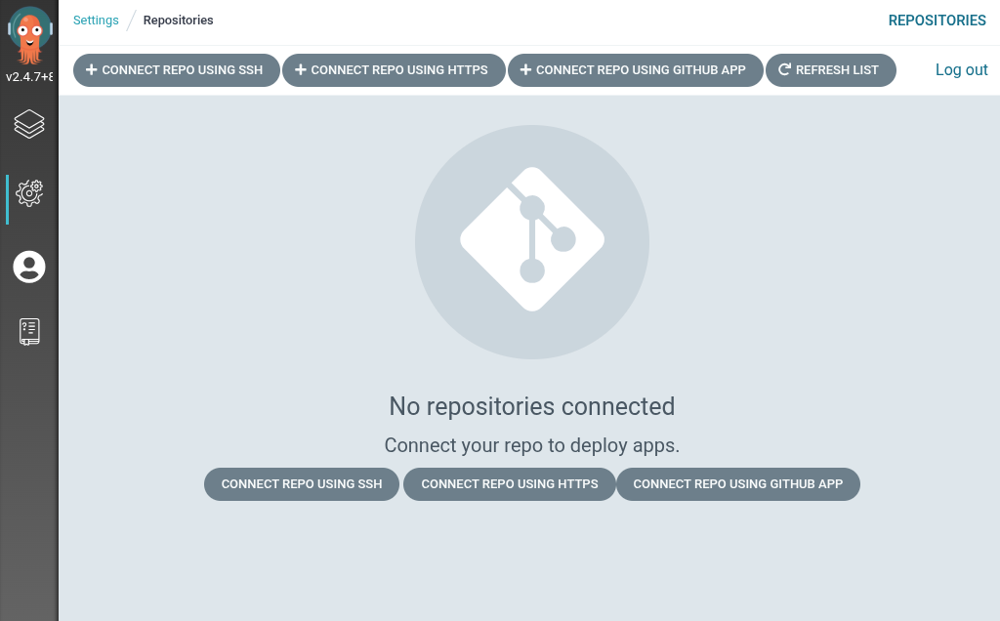


Now, provide the repository name where your Manifests files are present. Provide the username and GitHub Personal Access token if your repo is private and click on CONNECT.


